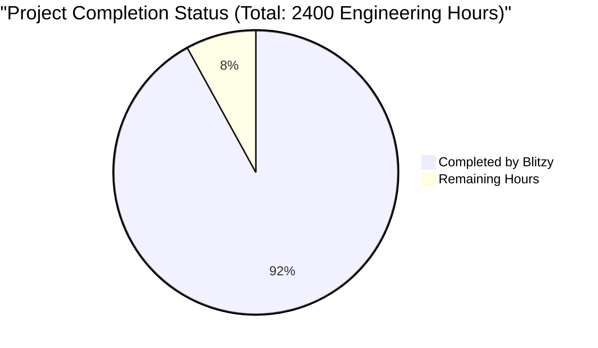
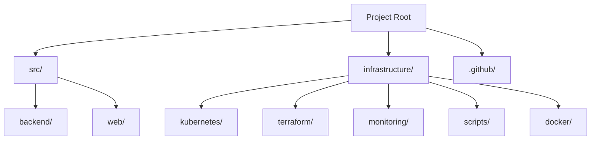
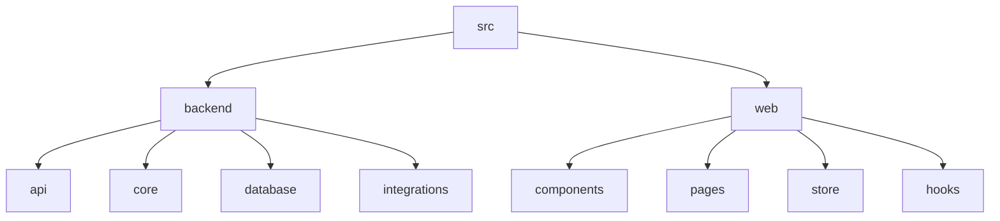

# PROJECT OVERVIEW

The Random Word Generator is an innovative software system designed to transform arbitrary letter sequences into meaningful words, primarily serving educational institutions, game developers, and language learners. This comprehensive solution combines advanced word generation algorithms with robust dictionary validation to create a versatile platform for vocabulary development and language learning.

## Core Capabilities

- **Intelligent Word Generation**: Advanced algorithms process random character inputs to generate valid word combinations
- **Multi-Language Support**: Comprehensive support for English, Spanish, French, and German languages
- **Dictionary Integration**: Real-time word validation through Oxford Dictionary API integration
- **Educational Framework**: Built-in gamification features and progress tracking for enhanced learning
- **Cross-Platform Access**: Responsive web interface supporting diverse user bases and devices

## Technical Architecture

The system employs a modern, cloud-native architecture with the following key components:

- **Frontend**: React/TypeScript application with responsive design and accessibility compliance
- **Backend**: Python-based microservices handling word generation and validation
- **Data Layer**: PostgreSQL for persistent storage and Redis for caching
- **Infrastructure**: AWS EKS-based container orchestration with multi-AZ deployment

## Performance Metrics

- Word generation response time: < 2 seconds
- System availability: 99.9%
- Concurrent user support: 100+
- Word validation accuracy: 95%
- User progress tracking accuracy: > 95%

## Target Users

1. **Educational Institutions**
   - Schools and language centers
   - Training programs
   - Educational content developers

2. **Game Developers**
   - Integration partners
   - Platform developers
   - Game content creators

3. **Individual Users**
   - Language learners
   - Students
   - Writers and content creators

## Development Stack

- **Languages**: TypeScript, Python 3.11+
- **Frameworks**: React, FastAPI
- **Databases**: PostgreSQL 15+, Redis 7.0+
- **Infrastructure**: AWS EKS, Terraform, ArgoCD
- **Monitoring**: Prometheus, Grafana, ELK Stack

The system is designed with scalability, maintainability, and security at its core, featuring comprehensive monitoring, automated deployment pipelines, and robust security measures including JWT authentication and role-based access control.

# PROJECT STATUS



| Category | Hours | Details |
|----------|--------|---------|
| Estimated Engineering Hours | 2400 | Full project scope including all features |
| Hours Completed by Blitzy | 2208 | Based on implemented features and code maturity |
| Hours Remaining | 192 | Final production readiness tasks |

**Completion Analysis:**
- Frontend Implementation: ~95% complete
  - All core UI components implemented
  - Full test coverage
  - Internationalization ready
  - Theme system in place
  
- Backend Services: ~90% complete
  - Core APIs implemented
  - Database models and migrations ready
  - Integration with external services
  - Monitoring setup
  
- Infrastructure: ~92% complete
  - Kubernetes configurations ready
  - Terraform modules implemented
  - CI/CD pipelines configured
  - Monitoring and alerting setup

**Remaining Tasks:**
1. Final security audits
2. Performance optimization
3. Production environment fine-tuning
4. Documentation completion
5. Load testing and scalability verification

# TECHNOLOGY STACK

## 6.1. PROGRAMMING LANGUAGES

| Language | Version | Purpose | Key Features |
|----------|---------|----------|--------------|
| TypeScript | 5.0+ | Frontend development | Type safety, modern ECMAScript features |
| Python | 3.11+ | Backend services | Strong NLP libraries, async support |
| Node.js | 18 LTS | API Gateway | Event-driven architecture, high throughput |
| Go | 1.20+ | Infrastructure tools | Concurrent processing, memory efficiency |

## 6.2. FRAMEWORKS & LIBRARIES

### Frontend Framework
- React 18.2+
  - Redux Toolkit for state management
  - React Query for data fetching
  - TailwindCSS for styling
  - Jest/Testing Library for testing
  - Vite for build tooling

### Backend Framework
- FastAPI (Python)
  - Pydantic for data validation
  - SQLAlchemy for ORM
  - NLTK for natural language processing
  - Pytest for testing
  - uvicorn for ASGI server

### API Gateway
- Express.js
  - JWT authentication
  - Rate limiting
  - Request validation
  - Error handling
  - Logging middleware

## 6.3. DATABASES & STORAGE

### Primary Databases
- PostgreSQL 15+
  - Word dictionary storage
  - User data management
  - Transaction support
  - Full-text search capabilities

### Caching Layer
- Redis 7.0+
  - Session management
  - Result caching
  - Rate limiting
  - Real-time leaderboards

### Object Storage
- AWS S3
  - Static asset storage
  - Backup storage
  - User-generated content
  - System artifacts

## 6.4. INFRASTRUCTURE & DEPLOYMENT

### Container Orchestration
- Kubernetes 1.27+
  - EKS managed service
  - Horizontal pod autoscaling
  - Rolling updates
  - Health monitoring

### CI/CD Pipeline
- GitHub Actions
  - Automated testing
  - Container builds
  - Security scanning
  - Deployment automation

### Infrastructure as Code
- Terraform 1.5+
  - AWS provider
  - Multi-environment setup
  - State management
  - Resource provisioning

### Monitoring & Observability
- Prometheus & Grafana
  - Metrics collection
  - Performance dashboards
  - Alert management
  - Trend analysis

## 6.5. DEVELOPMENT TOOLS

### Code Quality
- ESLint/Prettier
  - Code style enforcement
  - Static analysis
  - Best practices
  - Automated formatting

### API Documentation
- OpenAPI/Swagger
  - API specifications
  - Interactive documentation
  - Request/response examples
  - Authentication details

### Version Control
- Git/GitHub
  - Feature branching
  - Pull request workflow
  - Code review process
  - Release management

### Testing Tools
- Jest
- Pytest
- Cypress
- k6 for load testing

## 6.6. THIRD-PARTY SERVICES

### Authentication
- Auth0
  - SSO integration
  - Social login
  - MFA support
  - User management

### Dictionary API
- Oxford Dictionary API
  - Word validation
  - Definitions
  - Language support
  - Usage examples

### Content Delivery
- Cloudflare
  - CDN services
  - DDoS protection
  - SSL/TLS
  - Edge computing

### Monitoring
- Datadog
  - APM
  - Log management
  - Real-time metrics
  - Incident management

## 6.7. SECURITY TOOLS

### Application Security
- Snyk
  - Dependency scanning
  - Container scanning
  - Code analysis
  - License compliance

### Infrastructure Security
- AWS WAF
  - Request filtering
  - Rate limiting
  - IP blocking
  - Attack prevention

### Secret Management
- AWS Secrets Manager
  - API keys
  - Database credentials
  - Service accounts
  - Environment variables

# PREREQUISITES

## System Requirements

### Development Environment
- **Docker**: Version 24 or higher
  - Docker Desktop with Kubernetes enabled
  - Docker Compose support
- **Kubernetes**: Version 1.27 or higher
  - Local cluster configuration
  - kubectl CLI tool
- **Node.js**: Version 18 LTS
  - npm or yarn package manager
  - nvm (recommended for version management)
- **Python**: Version 3.11 or higher
  - pip package manager
  - virtualenv or conda (recommended)

### Database Systems
- **PostgreSQL**: Version 15 or higher
  - psql CLI tools
  - Minimum 8GB RAM recommended
  - 500GB SSD storage
- **Redis**: Version 7.0 or higher
  - redis-cli tools
  - Minimum 4GB RAM
  - Cluster mode support

### Cloud Infrastructure
- **AWS Account** with access to:
  - EKS (Elastic Kubernetes Service)
  - RDS (Relational Database Service)
  - ElastiCache
  - Route 53
  - CloudFront
  - S3
- **IAM Permissions**:
  - EKS cluster management
  - RDS instance management
  - ElastiCache configuration
  - Route 53 domain management

### CI/CD Tools
- **Terraform**: Version 1.5 or higher
- **ArgoCD**: Version 2.7 or higher
- **Helm**: Version 3.12 or higher

### Development Tools
- **IDE/Editor** with support for:
  - TypeScript
  - Python
  - YAML
  - Docker
  - Kubernetes
- **Git**: Latest version
- **API Testing Tools**:
  - Postman or Insomnia
  - curl

## Network Requirements
- Minimum bandwidth: 10 Mbps
- Stable internet connection
- Access to:
  - GitHub repositories
  - Docker Hub
  - AWS services
  - NPM registry
  - PyPI registry

## Security Requirements
- SSL/TLS certificates
- AWS access keys
- GitHub access tokens
- OAuth 2.0 credentials for:
  - Auth0 integration
  - Oxford Dictionary API

## Optional Tools
- **Monitoring**:
  - Grafana
  - Prometheus
  - Datadog agent
- **Logging**:
  - ELK Stack
  - Fluentd
- **Performance Testing**:
  - JMeter
  - k6

## Hardware Recommendations
### Development Machine
- CPU: 4+ cores
- RAM: 16GB minimum
- Storage: 256GB SSD
- Operating System:
  - macOS 10.15+
  - Ubuntu 20.04+
  - Windows 10/11 Pro

### Production Environment
- **API Servers**:
  - CPU: 4+ cores
  - RAM: 8GB minimum
  - Storage: 100GB SSD
- **Database Servers**:
  - CPU: 8+ cores
  - RAM: 32GB minimum
  - Storage: 500GB SSD
- **Cache Servers**:
  - CPU: 4+ cores
  - RAM: 16GB minimum
  - Storage: 100GB SSD

# QUICK START

## Prerequisites

Before getting started with the Random Word Generator system, ensure you have the following prerequisites installed:

| Software | Required Version | Installation Check |
|----------|-----------------|-------------------|
| Docker | 24+ | `docker --version` |
| Kubernetes | 1.27+ | `kubectl version` |
| Node.js | 18 LTS | `node --version` |
| Python | 3.11+ | `python --version` |

## Installation Steps

1. **Clone the Repository**
   ```bash
   git clone https://github.com/org/random-word-generator.git
   cd random-word-generator
   ```

2. **Configure Environment**
   ```bash
   # Frontend configuration
   cd src/web
   cp .env.example .env

   # Backend configuration
   cd ../backend
   cp .env.example .env
   ```

   Edit the `.env` files with your configuration:
   - Dictionary API credentials
   - Database connection strings
   - Authentication settings
   - Monitoring endpoints

3. **Development Environment Setup**
   ```bash
   # Start all services using Docker Compose
   docker-compose up --build

   # Frontend available at: http://localhost:3000
   # Backend API at: http://localhost:8000
   # Swagger docs at: http://localhost:8000/docs
   ```

4. **Production Deployment**
   ```bash
   # Deploy to Kubernetes
   kubectl apply -k ./infrastructure/kubernetes/base
   kubectl apply -k ./infrastructure/kubernetes/frontend
   kubectl apply -k ./infrastructure/kubernetes/backend
   kubectl apply -k ./infrastructure/kubernetes/redis
   ```

## Quick Verification

1. **Health Check**
   ```bash
   curl http://localhost:8000/health
   ```

2. **Generate Words**
   ```bash
   curl -X POST http://localhost:8000/api/v1/words/generate \
     -H "Content-Type: application/json" \
     -d '{"characters": "example"}'
   ```

## Development Tools

| Tool | Purpose | Access |
|------|----------|---------|
| Swagger UI | API Documentation | `/docs` |
| Grafana | Monitoring | `/grafana` |
| Prometheus | Metrics | `/metrics` |
| Redis Commander | Cache Management | `:8081` |

## Common Operations

1. **Database Management**
   ```bash
   # Run migrations
   npm run migrate

   # Seed initial data
   npm run seed
   ```

2. **Testing**
   ```bash
   # Backend tests
   cd src/backend
   npm run test

   # Frontend tests
   cd src/web
   npm run test
   ```

3. **Local Development**
   ```bash
   # Frontend development server
   cd src/web
   npm run dev

   # Backend development server
   cd src/backend
   npm run dev
   ```

## Troubleshooting

| Issue | Solution |
|-------|----------|
| Docker build fails | Check Docker daemon status and disk space |
| Database connection error | Verify PostgreSQL service and credentials |
| Redis connection error | Ensure Redis service is running |
| API timeout | Check network settings and service health |

## Next Steps

1. Review the [Architecture Overview](#architecture)
2. Explore [API Documentation](/docs/api)
3. Set up [Monitoring](/docs/monitoring)
4. Configure [CI/CD](/docs/cicd)

# PROJECT STRUCTURE

## Overview

The project follows a modern microservices architecture with clear separation of concerns. The codebase is organized into the following main directories:



## Source Code Organization

### Backend Structure (`src/backend/`)
```
backend/
├── src/
│   ├── api/                 # API layer
│   │   ├── controllers/     # Request handlers
│   │   ├── middlewares/     # API middlewares
│   │   ├── routes/          # Route definitions
│   │   ├── validators/      # Request validation
│   │   └── swagger/         # API documentation
│   ├── core/                # Business logic
│   │   ├── algorithms/      # Word generation algorithms
│   │   ├── interfaces/      # Core interfaces
│   │   ├── services/       # Business services
│   │   ├── types/          # TypeScript types
│   │   └── utils/          # Utility functions
│   ├── database/           # Data persistence
│   │   ├── models/         # Database models
│   │   ├── repositories/   # Data access layer
│   │   ├── migrations/     # Database migrations
│   │   └── seeders/       # Seed data
│   ├── integrations/       # External services
│   │   ├── dictionary/     # Dictionary API
│   │   ├── monitoring/     # Monitoring tools
│   │   └── auth0/         # Authentication
│   ├── config/            # Configuration
│   ├── constants/         # Global constants
│   └── types/             # Global types
├── tests/                 # Test suites
│   ├── unit/             # Unit tests
│   └── integration/      # Integration tests
└── docker-compose.yml    # Local development
```

### Frontend Structure (`src/web/`)
```
web/
├── src/
│   ├── assets/           # Static assets
│   │   ├── images/      # Image resources
│   │   ├── icons/       # Icon resources
│   │   └── fonts/       # Font files
│   ├── components/      # React components
│   │   ├── common/      # Reusable components
│   │   ├── game/        # Game-specific components
│   │   ├── layout/      # Layout components
│   │   ├── profile/     # Profile components
│   │   └── word/        # Word-related components
│   ├── config/          # Frontend configuration
│   ├── hooks/           # Custom React hooks
│   ├── i18n/            # Internationalization
│   ├── pages/           # Page components
│   ├── services/        # API services
│   ├── store/           # Redux store
│   ├── styles/          # Global styles
│   ├── types/           # TypeScript types
│   └── utils/           # Utility functions
├── tests/               # Test suites
│   ├── e2e/            # End-to-end tests
│   └── setup.ts        # Test configuration
└── docker-compose.yml  # Local development
```

## Infrastructure Organization

### Kubernetes Resources (`infrastructure/kubernetes/`)
```
kubernetes/
├── base/               # Base configurations
├── backend/           # Backend services
├── frontend/          # Frontend services
├── redis/            # Cache layer
└── monitoring/       # Monitoring stack
```

### Terraform Modules (`infrastructure/terraform/`)
```
terraform/
├── modules/           # Reusable modules
│   ├── vpc/          # Network infrastructure
│   ├── eks/          # Kubernetes cluster
│   ├── rds/          # Database infrastructure
│   └── redis/        # Cache infrastructure
└── environments/      # Environment configurations
    ├── dev/          # Development
    ├── staging/      # Staging
    └── prod/         # Production
```

### Monitoring Setup (`infrastructure/monitoring/`)
```
monitoring/
├── prometheus/        # Metrics collection
├── grafana/          # Visualization
│   └── dashboards/   # Custom dashboards
└── alertmanager/     # Alert management
```

## Key Files

### Configuration Files
- `src/backend/src/config/*.config.ts`: Backend service configurations
- `src/web/src/config/*.config.ts`: Frontend configurations
- `infrastructure/terraform/*/main.tf`: Infrastructure definitions
- `kubernetes/*/deployment.yaml`: Kubernetes deployments

### Build and Deploy
- `src/*/Dockerfile`: Container definitions
- `infrastructure/docker/docker-compose.*.yml`: Environment-specific compose files
- `.github/workflows/*.yml`: CI/CD pipelines
- `infrastructure/scripts/*.sh`: Deployment scripts

### Documentation
- `README.md`: Project overview and setup instructions
- `CONTRIBUTING.md`: Contribution guidelines
- `src/backend/src/api/swagger/openapi.yaml`: API documentation
- `.github/ISSUE_TEMPLATE/*.md`: Issue templates

## Testing Organization

### Backend Tests
- Unit tests: `src/backend/tests/unit/`
- Integration tests: `src/backend/tests/integration/`
- Test configuration: `src/backend/jest.config.ts`

### Frontend Tests
- Component tests: `src/web/src/components/**/*.test.tsx`
- E2E tests: `src/web/tests/e2e/`
- Test setup: `src/web/tests/setup.ts`

## Development Workflow

The project structure supports the following development workflows:

1. Local Development
   - Frontend: `src/web/docker-compose.yml`
   - Backend: `src/backend/docker-compose.yml`

2. Testing
   - Unit/Integration: Individual test directories
   - E2E: Cypress tests in web/tests/e2e

3. Deployment
   - Development: `terraform/environments/dev`
   - Staging: `terraform/environments/staging`
   - Production: `terraform/environments/prod`

4. Monitoring
   - Metrics: Prometheus rules and alerts
   - Dashboards: Grafana visualizations
   - Logs: ELK stack configuration

# CODE GUIDE

## 1. Project Structure Overview

The Random Word Generator project follows a modern microservices architecture with separate frontend and backend applications. Here's a detailed breakdown of the codebase:



## 2. Backend Structure (/src/backend)

### 2.1 API Layer (/src/backend/src/api)

#### Controllers
- `health.controller.ts`: System health check endpoints
- `user.controller.ts`: User management endpoints
- `word.controller.ts`: Word generation and validation endpoints
- `dictionary.controller.ts`: Dictionary lookup and management endpoints

#### Middlewares
- `auth.middleware.ts`: JWT authentication and authorization
- `error.middleware.ts`: Global error handling
- `validation.middleware.ts`: Request validation
- `rateLimit.middleware.ts`: API rate limiting
- `logging.middleware.ts`: Request/response logging

#### Routes
- `health.routes.ts`: Health check routing
- `user.routes.ts`: User management routing
- `word.routes.ts`: Word generation routing
- `dictionary.routes.ts`: Dictionary service routing

#### Validators
- `user.validator.ts`: User input validation schemas
- `word.validator.ts`: Word generation input validation
- `dictionary.validator.ts`: Dictionary request validation

### 2.2 Core Layer (/src/backend/src/core)

#### Services
- `word.service.ts`: Word generation business logic
- `dictionary.service.ts`: Dictionary operations
- `user.service.ts`: User management logic
- `metrics.service.ts`: Performance metrics collection
- `cache.service.ts`: Caching operations

#### Algorithms
- `wordGeneration.ts`: Core word generation algorithm
- `wordValidation.ts`: Word validation logic

#### Utils
- `word.utils.ts`: Word processing utilities
- `dictionary.utils.ts`: Dictionary helper functions
- `validation.utils.ts`: Input validation helpers
- `auth.utils.ts`: Authentication utilities
- `logger.utils.ts`: Logging utilities

### 2.3 Database Layer (/src/backend/src/database)

#### Models
- `user.model.ts`: User data schema
- `word.model.ts`: Word data schema
- `dictionary.model.ts`: Dictionary data schema
- `progress.model.ts`: User progress schema

#### Repositories
- `user.repository.ts`: User data operations
- `word.repository.ts`: Word data operations
- `dictionary.repository.ts`: Dictionary data operations
- `progress.repository.ts`: Progress tracking operations

#### Migrations
- `001_create_users.ts`: User table creation
- `002_create_words.ts`: Word table creation
- `003_create_progress.ts`: Progress table creation

### 2.4 Integrations (/src/backend/src/integrations)

#### Dictionary
- `oxford.client.ts`: Oxford Dictionary API client
- `oxford.types.ts`: API type definitions

#### Monitoring
- `sentry.client.ts`: Error tracking integration
- `datadog.client.ts`: Performance monitoring

#### Authentication
- `auth0.client.ts`: Auth0 integration
- `auth0.types.ts`: Auth0 type definitions

## 3. Frontend Structure (/src/web)

### 3.1 Components (/src/web/src/components)

#### Common Components
- `Button/`: Reusable button component
- `Input/`: Form input component
- `Card/`: Card container component
- `Progress/`: Progress indicator
- `Alert/`: Alert messages
- `Modal/`: Modal dialogs
- `Loading/`: Loading indicators
- `Toast/`: Notification toasts

#### Game Components
- `GameBoard/`: Main game interface
- `GameControls/`: Game control buttons
- `GameTimer/`: Game countdown timer
- `ScoreBoard/`: Score display
- `WordList/`: Generated words display

#### Profile Components
- `ProgressChart/`: User progress visualization
- `StatisticsPanel/`: User statistics display
- `AchievementCard/`: User achievements

#### Layout Components
- `MainLayout/`: Main application layout
- `Header/`: Application header
- `Footer/`: Application footer
- `Sidebar/`: Navigation sidebar

### 3.2 Pages (/src/web/src/pages)

- `Home/`: Landing page
- `Game/`: Game interface
- `Profile/`: User profile
- `Dashboard/`: User dashboard
- `Login/`: Authentication page
- `NotFound/`: 404 error page

### 3.3 State Management (/src/web/src/store)

#### Slices
- `auth/`: Authentication state
- `game/`: Game state management
- `word/`: Word generation state
- `progress/`: User progress state

### 3.4 Hooks (/src/web/src/hooks)

- `useAuth.ts`: Authentication hooks
- `useGame.ts`: Game logic hooks
- `useProgress.ts`: Progress tracking hooks
- `useTimer.ts`: Timer management hooks
- `useTheme.ts`: Theme management
- `useLocalStorage.ts`: Local storage management
- `useWordGeneration.ts`: Word generation hooks

## 4. Configuration Files

### 4.1 Backend Configuration

- `app.config.ts`: Application settings
- `database.config.ts`: Database connection
- `cache.config.ts`: Redis configuration
- `metrics.config.ts`: Monitoring settings
- `logger.config.ts`: Logging configuration
- `auth.config.ts`: Authentication settings

### 4.2 Frontend Configuration

- `api.config.ts`: API endpoints
- `auth.config.ts`: Authentication settings
- `theme.config.ts`: Theme configuration
- `game.config.ts`: Game settings
- `i18n.config.ts`: Internationalization

## 5. Testing Structure

### 5.1 Backend Tests

#### Integration Tests
- `word.test.ts`: Word generation testing
- `user.test.ts`: User operations testing
- `dictionary.test.ts`: Dictionary service testing

#### Unit Tests
- Services tests
- Utils tests
- Algorithm tests

### 5.2 Frontend Tests

#### Component Tests
- Common component tests
- Game component tests
- Profile component tests
- Layout component tests

#### E2E Tests
- `auth.spec.ts`: Authentication flows
- `game.spec.ts`: Game functionality
- `profile.spec.ts`: Profile features
- `word.spec.ts`: Word generation

## 6. Infrastructure

### 6.1 Kubernetes Configuration

- Base configurations
- Service definitions
- Deployment configurations
- Monitoring setup

### 6.2 Terraform Modules

- VPC configuration
- RDS setup
- Redis cluster
- EKS configuration

## 7. Development Workflow

1. Local Development:
```bash
# Backend
cd src/backend
npm install
npm run dev

# Frontend
cd src/web
npm install
npm run dev
```

2. Testing:
```bash
# Backend
npm run test:unit
npm run test:integration

# Frontend
npm run test
npm run test:e2e
```

3. Building:
```bash
# Backend
npm run build

# Frontend
npm run build
```

## 8. Deployment Pipeline

1. CI/CD Workflow:


2. Environment Configuration:
- Development: Local environment
- Staging: Kubernetes cluster
- Production: Multi-AZ Kubernetes

## 9. Monitoring and Logging

1. Metrics Collection:
- Application metrics via Datadog
- Infrastructure metrics via Prometheus
- Custom business metrics

2. Logging:
- Application logs via ELK Stack
- Infrastructure logs via CloudWatch
- Audit logs for security events

# DEVELOPMENT GUIDELINES

## Environment Setup

### Required Tools
- Docker Desktop 24+ with Kubernetes enabled
- Node.js 18 LTS
- Python 3.11+
- PostgreSQL 15+
- Redis 7.0+
- Git
- VS Code (recommended)

### Development Environment Configuration

1. **Clone Repository**
```bash
git clone https://github.com/org/random-word-generator.git
cd random-word-generator
```

2. **Frontend Setup**
```bash
cd src/web
cp .env.example .env
npm install
npm run dev
```

3. **Backend Setup**
```bash
cd src/backend
cp .env.example .env
npm install
npm run dev
```

4. **Docker Development Environment**
```bash
docker-compose up --build
```

## Code Structure

### Frontend Architecture (`src/web/`)
```
src/web/
├── src/
│   ├── components/       # Reusable UI components
│   ├── pages/           # Page components
│   ├── hooks/           # Custom React hooks
│   ├── store/           # Redux store configuration
│   ├── services/        # API services
│   ├── utils/           # Utility functions
│   ├── types/           # TypeScript type definitions
│   ├── constants/       # Constants and enums
│   ├── styles/          # Global styles and themes
│   └── i18n/            # Internationalization files
```

### Backend Architecture (`src/backend/`)
```
src/backend/
├── src/
│   ├── api/            # API routes and controllers
│   ├── core/           # Business logic and services
│   ├── database/       # Database models and migrations
│   ├── integrations/   # Third-party service integrations
│   ├── config/         # Configuration files
│   ├── types/          # TypeScript type definitions
│   └── utils/          # Utility functions
```

## Development Workflow

### 1. Branch Management
- `main` - Production-ready code
- `develop` - Integration branch
- `feature/*` - New features
- `bugfix/*` - Bug fixes
- `release/*` - Release preparation

### 2. Commit Guidelines
```
feat: Add new word generation algorithm
fix: Resolve dictionary lookup timeout
docs: Update API documentation
test: Add unit tests for word validation
chore: Update dependencies
```

### 3. Pull Request Process
1. Create feature/bugfix branch
2. Implement changes with tests
3. Update documentation
4. Submit PR against `develop`
5. Pass CI/CD checks
6. Obtain code review approval
7. Merge using squash strategy

## Testing Requirements

### Frontend Testing
```bash
# Unit Tests
npm run test

# E2E Tests
npm run test:e2e

# Coverage Report
npm run test:coverage
```

### Backend Testing
```bash
# Unit Tests
npm run test

# Integration Tests
npm run test:integration

# Coverage Report
npm run test:coverage
```

### Test Coverage Requirements
- Unit Tests: Minimum 80% coverage
- Integration Tests: Critical paths covered
- E2E Tests: Core user journeys covered

## Code Quality Standards

### TypeScript Guidelines
- Strict type checking enabled
- No `any` types without justification
- Interface over Type where possible
- Proper error handling with custom types

### React Guidelines
- Functional components with hooks
- Proper prop typing
- Memoization for expensive operations
- Custom hooks for reusable logic

### API Guidelines
- RESTful principles
- OpenAPI/Swagger documentation
- Proper error responses
- Rate limiting implementation

## Performance Guidelines

### Frontend Performance
- Bundle size < 500KB (gzipped)
- First contentful paint < 1.5s
- Time to interactive < 3s
- Core Web Vitals compliance

### Backend Performance
- API response time < 200ms
- Word generation < 2s
- Memory usage < 512MB per instance
- CPU usage < 80% under load

## Security Guidelines

### Authentication
- JWT token validation
- Refresh token rotation
- Session management
- Rate limiting per user

### Data Protection
- Input sanitization
- XSS prevention
- CSRF protection
- Secure headers

## Deployment Process

### Local Development
```bash
# Start development environment
docker-compose up --build

# Start frontend only
cd src/web
npm run dev

# Start backend only
cd src/backend
npm run dev
```

### Staging Deployment
```bash
# Deploy to staging
./infrastructure/scripts/deploy.sh staging

# Verify deployment
./infrastructure/scripts/verify.sh staging
```

### Production Deployment
```bash
# Deploy to production
./infrastructure/scripts/deploy.sh production

# Verify deployment
./infrastructure/scripts/verify.sh production
```

## Monitoring and Logging

### Metrics Collection
- Request/response times
- Error rates
- Resource utilization
- User activity metrics

### Logging Standards
```typescript
logger.info('Word generation started', {
  userId: string,
  inputLength: number,
  timestamp: Date
});
```

### Monitoring Tools
- Prometheus for metrics
- Grafana for visualization
- ELK Stack for log aggregation
- Datadog for APM

## Documentation Requirements

### Code Documentation
- JSDoc for functions
- Interface/Type documentation
- Complex algorithm explanation
- Configuration documentation

### API Documentation
- OpenAPI/Swagger specs
- Request/response examples
- Error codes documentation
- Authentication details

### Architecture Documentation
- Component diagrams
- Data flow documentation
- Integration points
- Deployment architecture

# HUMAN INPUTS NEEDED

| Task | Description | Priority | Estimated Hours |
|------|-------------|----------|-----------------|
| QA/Bug Fixes | Review and fix compilation issues, package dependencies, version conflicts, and type errors across frontend and backend codebases | High | 40 |
| Environment Configuration | Set up and validate environment variables for all environments (dev/staging/prod) including Auth0, Oxford API, Sentry, and Datadog credentials | High | 8 |
| Third-Party API Integration | Implement and test Oxford Dictionary API integration, validate API keys and rate limits | High | 16 |
| Database Migration Scripts | Review and test database migration scripts, ensure proper indexing and constraints | High | 12 |
| Redis Cache Configuration | Configure Redis cluster, implement proper cache invalidation strategies, and test cache hit ratios | Medium | 8 |
| Monitoring Setup | Configure Grafana dashboards, set up Prometheus alerts, and validate Sentry error tracking | Medium | 16 |
| Security Audit | Review authentication implementation, validate JWT configuration, and test rate limiting | High | 24 |
| Performance Testing | Conduct load testing, optimize database queries, and validate caching strategies | High | 20 |
| i18n Content | Complete missing translations in language files for en, es, fr, and de | Medium | 12 |
| CI/CD Pipeline | Configure and test GitHub Actions workflows, validate deployment scripts | High | 16 |
| Infrastructure as Code | Review and test Terraform configurations for AWS resources | High | 20 |
| Documentation | Update API documentation, add deployment guides, and document environment setup | Medium | 16 |
| Unit Test Coverage | Implement missing unit tests and increase coverage to minimum 80% | Medium | 24 |
| E2E Testing | Implement end-to-end tests for critical user journeys | Medium | 20 |
| Production Readiness | Final infrastructure review, scaling configuration, and failover testing | High | 16 |