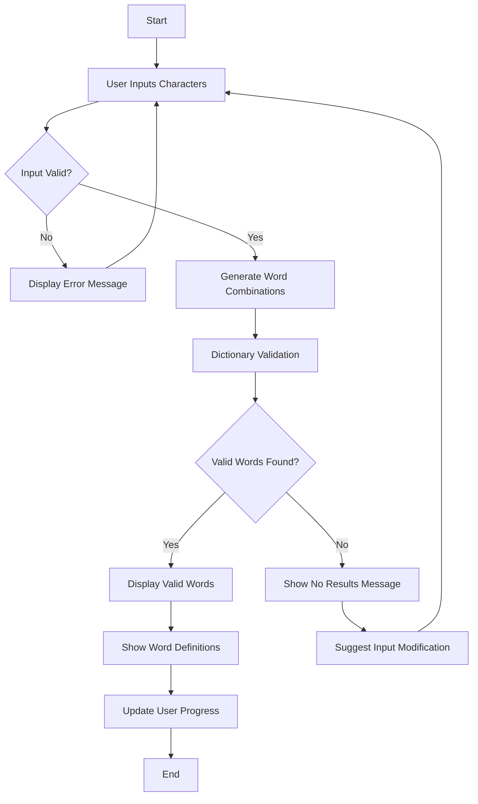

# Technical Specifications

# 1. INTRODUCTION

## 1.1. EXECUTIVE SUMMARY

The Random Word Generator Using Random Characters project aims to create an intelligent word generation system that transforms arbitrary letter sequences into meaningful words. This solution addresses the growing need for educational tools, word game platforms, and language learning assistance.

| Stakeholder Category | Description |
|---------------------|-------------|
| Primary Users | Students, Language Learners, Game Players, Writers |
| Educational Institutions | Schools, Language Centers, Training Programs |
| Game Developers | Integration Partners, Platform Developers |
| Content Creators | Writers, Publishers, Educational Content Developers |

**Value Proposition:**
- Enhanced vocabulary development through interactive word discovery
- Gamified learning experience with competitive elements
- Cross-platform accessibility for diverse user bases
- Scalable architecture supporting multiple languages and use cases

## 1.2. SYSTEM OVERVIEW

### Project Context

| Aspect | Details |
|--------|----------|
| Market Position | Educational Technology, Gaming, Language Learning |
| Target Market | Global, Multi-language, Cross-platform |
| Integration Points | Dictionary APIs, Learning Management Systems, Gaming Platforms |

### High-Level Description

The system employs a modular architecture with these core components:

1. Input Processing Engine
2. Word Generation Algorithm
3. Dictionary Validation Service
4. Multi-language Support System
5. Gamification Framework
6. Educational Content Management

### Success Criteria

| KPI Category | Metrics |
|--------------|---------|
| Performance | - Word generation response time < 2 seconds<br>- 99.9% system availability<br>- Support for 100+ concurrent users |
| Accuracy | - 95% word validation accuracy<br>- < 1% false positive rate |
| Engagement | - Average session duration > 5 minutes<br>- Daily active users growth rate > 10% |
| Educational | - Vocabulary retention rate > 70%<br>- User progress tracking accuracy > 95% |

## 1.3. SCOPE

### In-Scope Elements

**Core Features:**
- Random character input processing
- Dictionary-based word validation
- Multi-language word generation
- Basic gamification features
- Word definitions and associations
- User progress tracking
- Cross-platform web interface

**Implementation Boundaries:**

| Boundary Type | Coverage |
|--------------|----------|
| Geographic | Global deployment |
| Language | English (initial), Spanish, French, German |
| User Types | Students, Teachers, Individual Users, Game Players |
| Data Domains | Dictionary Words, User Profiles, Achievement Data |

### Out-of-Scope Elements

1. Advanced Features:
   - Voice recognition input
   - Handwriting recognition
   - Real-time multiplayer functionality
   - Advanced AI-powered suggestions
   - Custom dictionary creation

2. Integration Limitations:
   - Social media platform integration
   - Payment processing systems
   - Third-party game platform integration
   - Enterprise SSO systems

3. Future Considerations:
   - Mobile native applications
   - Offline mode functionality
   - Advanced analytics dashboard
   - Custom content creation tools

# 2. PRODUCT REQUIREMENTS

## 2.1. FEATURE CATALOG

### Core Features

| Feature ID | Feature Name | Category | Priority | Status |
|------------|--------------|-----------|----------|---------|
| F-001 | Character Input Processing | Input | Critical | Approved |
| F-002 | Word Generation Engine | Processing | Critical | Approved |
| F-003 | Dictionary Validation | Validation | Critical | Approved |
| F-004 | Word Definition Display | Content | High | Approved |
| F-005 | Multi-language Support | Language | High | Proposed |

### Feature Details

#### F-001: Character Input Processing
- **Description**: Accepts and validates user input of random characters
- **Business Value**: Core functionality enabling word generation
- **User Benefits**: Flexible input methods and immediate feedback
- **Dependencies**:
  - System: Input validation library
  - External: None
  - Integration: UI Framework

#### F-002: Word Generation Engine
- **Description**: Generates possible word combinations from input characters
- **Business Value**: Primary system functionality
- **User Benefits**: Efficient word discovery
- **Dependencies**:
  - Prerequisite: F-001
  - System: Algorithm optimization library
  - Integration: Dictionary API

#### F-003: Dictionary Validation
- **Description**: Validates generated words against dictionary
- **Business Value**: Ensures accuracy and legitimacy
- **User Benefits**: Guaranteed valid words
- **Dependencies**:
  - Prerequisite: F-002
  - External: Dictionary API
  - Integration: Word database

## 2.2. FUNCTIONAL REQUIREMENTS TABLE

### Input Processing Requirements

| Requirement ID | Description | Acceptance Criteria | Priority | Complexity |
|----------------|-------------|---------------------|----------|------------|
| F-001-RQ-001 | Accept alphabetic input | Valid character validation | Must-Have | Low |
| F-001-RQ-002 | Support variable length | 2-15 characters | Must-Have | Low |
| F-001-RQ-003 | Real-time validation | <100ms response | Should-Have | Medium |

### Word Generation Requirements

| Requirement ID | Description | Acceptance Criteria | Priority | Complexity |
|----------------|-------------|---------------------|----------|------------|
| F-002-RQ-001 | Generate all possible combinations | Complete word list | Must-Have | High |
| F-002-RQ-002 | Performance optimization | <2s processing time | Must-Have | High |
| F-002-RQ-003 | Word length filtering | Accurate filtering | Should-Have | Medium |

## 2.3. FEATURE RELATIONSHIPS

### Dependency Matrix

| Feature | Depends On | Required By |
|---------|------------|-------------|
| F-001 | None | F-002 |
| F-002 | F-001 | F-003, F-004 |
| F-003 | F-002 | F-004 |
| F-004 | F-003 | None |
| F-005 | F-001, F-002 | None |

### Integration Points

| Component | Integration Type | Dependencies |
|-----------|-----------------|--------------|
| Dictionary API | External API | F-003 |
| UI Framework | Internal | F-001 |
| Word Database | Internal | F-002, F-003 |

## 2.4. IMPLEMENTATION CONSIDERATIONS

### Technical Requirements

| Feature ID | Performance Target | Scalability Need | Security Level |
|------------|-------------------|------------------|----------------|
| F-001 | <100ms response | Medium | Low |
| F-002 | <2s processing | High | Low |
| F-003 | <1s validation | High | Medium |
| F-004 | <500ms lookup | Medium | Low |
| F-005 | <3s translation | Medium | Medium |

### Maintenance Requirements

| Component | Update Frequency | Monitoring Needs | Backup Requirements |
|-----------|-----------------|------------------|---------------------|
| Dictionary | Monthly | Usage metrics | Daily |
| Word Database | Weekly | Performance | Hourly |
| Language Packs | Quarterly | Completeness | Weekly |
| Validation Rules | Monthly | Accuracy | Daily |

# 3. PROCESS FLOWCHART

## 3.1. SYSTEM WORKFLOWS

### Core Business Process - Main User Journey



### Integration Workflow - Dictionary Service


## 3.2. FLOWCHART REQUIREMENTS

### Word Generation Process


### Error Handling Flow


## 3.3. TECHNICAL IMPLEMENTATION

### State Management Diagram


### Integration Sequence


## 3.4. VALIDATION RULES

| Process Step | Validation Rules | Error Handling |
|-------------|------------------|----------------|
| Input Processing | - 2-15 characters<br>- Alphabetic only<br>- No special characters | Return error message with specific violation |
| Word Generation | - Maximum 100,000 combinations<br>- Memory limit 512MB<br>- Timeout 5 seconds | Partial results with warning |
| Dictionary Validation | - API response < 2 seconds<br>- Valid dictionary entries only<br>- Language match | Fallback to cached dictionary |
| Results Display | - Maximum 1000 words<br>- Sort by length/frequency<br>- Filter by user preferences | Pagination and filtering options |

## 3.5. TIMING AND SLA REQUIREMENTS

| Process | Target Time | Maximum Time | Recovery Action |
|---------|------------|--------------|-----------------|
| Input Validation | 100ms | 500ms | Client-side validation |
| Word Generation | 1s | 3s | Background processing |
| Dictionary Lookup | 500ms | 2s | Cached results |
| Total Response | 2s | 5s | Progressive loading |

# 4. SYSTEM ARCHITECTURE

## 4.1. HIGH-LEVEL ARCHITECTURE


## 4.2. COMPONENT DETAILS

### Core Components

| Component | Purpose | Technology | Scaling Strategy |
|-----------|---------|------------|------------------|
| Web Frontend | User interface | React, TypeScript | Horizontal scaling, CDN |
| API Gateway | Request routing | Node.js/Express | Load balancer, Auto-scaling |
| Word Service | Word generation | Python/FastAPI | Container orchestration |
| Validation Service | Word verification | Python/FastAPI | Horizontal scaling |
| Cache Layer | Performance optimization | Redis | Cluster mode |
| User Database | User data storage | MongoDB | Sharding |
| Word Database | Dictionary storage | PostgreSQL | Read replicas |

### Service Interfaces


## 4.3. TECHNICAL DECISIONS

### Architecture Patterns

| Pattern | Implementation | Justification |
|---------|---------------|---------------|
| Microservices | Containerized services | Scalability, maintainability |
| Event-driven | Apache Kafka | Async processing, decoupling |
| CQRS | Separate read/write paths | Performance optimization |
| API Gateway | Express.js | Security, routing |

### Data Storage


## 4.4. CROSS-CUTTING CONCERNS

### Monitoring Architecture


### Security Zones


## 4.5. DEPLOYMENT ARCHITECTURE

```mermaid
C4Deployment
    title Deployment Diagram - Production Environment

    Deployment_Node(cdn, "CDN", "CloudFront") {
        Container(static, "Static Assets")
    }
    
    Deployment_Node(cloud, "Cloud Platform", "AWS") {
        Deployment_Node(eks, "Kubernetes Cluster") {
            Container(api, "API Services")
            Container(workers, "Worker Nodes")
        }
        Deployment_Node(dbs, "Database Cluster") {
            ContainerDb(db, "Databases")
            Container(cache, "Cache Cluster")
        }
    }
    
    Rel(cdn, eks, "Routes requests")
    Rel(eks, dbs, "Persists data")
```

### Infrastructure Requirements

| Component | Sizing | Redundancy | Backup |
|-----------|--------|------------|--------|
| API Servers | 4 cores, 8GB RAM | N+1 | N/A |
| Databases | 8 cores, 32GB RAM | Active-Passive | Daily |
| Cache | 4 cores, 16GB RAM | Multi-AZ | N/A |
| Storage | 500GB SSD | RAID-10 | Continuous |

# 5. SYSTEM COMPONENTS DESIGN

## 5.1. CORE SERVICES ARCHITECTURE

### Service Components


| Service | Responsibility | Communication Pattern | Discovery Method |
|---------|---------------|----------------------|------------------|
| Word Generation | Character processing, combination generation | Synchronous REST, Async Events | Kubernetes Service |
| Validation | Word verification, dictionary lookup | Synchronous REST | Kubernetes Service |
| User Service | Profile management, preferences | Synchronous REST | Kubernetes Service |
| Dictionary | Word lookup, definitions | Synchronous REST | Kubernetes Service |

#### Load Balancing Strategy

| Component | Strategy | Algorithm | Health Check |
|-----------|----------|-----------|--------------|
| API Gateway | Layer 7 | Round Robin | TCP/HTTP |
| Services | Service Mesh | Least Connection | gRPC Health |
| Database | Connection Pool | Random Selection | TCP Ping |

#### Circuit Breaker Configuration


### Scalability Design

| Component | Scaling Type | Triggers | Resource Limits |
|-----------|-------------|-----------|-----------------|
| Word Generation | Horizontal | CPU > 70%, Memory > 80% | 2-10 pods |
| Validation | Horizontal | Request Queue > 1000 | 3-15 pods |
| Dictionary | Vertical | Memory > 85% | 16GB RAM max |
| Cache | Horizontal | Memory > 75% | 3-6 nodes |

### Resilience Patterns


| Failure Scenario | Recovery Action | SLA Target | Data Loss Prevention |
|-----------------|-----------------|------------|---------------------|
| Service Failure | Failover to replica | 99.9% | Synchronous replication |
| Network Partition | Circuit break to cache | 99.5% | Write-ahead logging |
| Database Failure | Read replica promotion | 99.99% | Point-in-time recovery |

## 5.2. DATABASE DESIGN

### Schema Design


#### Indexing Strategy

| Table | Index Type | Columns | Purpose |
|-------|------------|---------|----------|
| WORD | B-tree | word, language | Fast lookup |
| USER | Hash | username | Unique constraint |
| PROGRESS | B-tree | user_id, updated_at | Range queries |

### Data Management

| Operation | Strategy | Frequency | Retention |
|-----------|----------|-----------|-----------|
| Backup | Full + Incremental | Daily/Hourly | 30 days |
| Archive | Cold Storage | Monthly | 7 years |
| Cleanup | Soft Delete | Weekly | Immediate |

#### Performance Optimization


## 5.3. INTEGRATION ARCHITECTURE

### API Design


| Endpoint | Method | Rate Limit | Authentication |
|----------|--------|------------|----------------|
| /api/v1/words | POST | 100/min | JWT |
| /api/v1/validate | GET | 200/min | API Key |
| /api/v1/users | GET | 50/min | OAuth2 |

### Message Processing


## 5.4. SECURITY ARCHITECTURE

### Authentication Framework

```mermaid
flowchart LR
    subgraph "Auth Flow"
        A[Client] --> B[Identity Provider]
        B --> C{MFA Required?}
        C -->|Yes| D[MFA Validation]
        C -->|No| E[Token Generation]
        D --> E
        E --> F[Session Creation]
    end
```

### Authorization System

| Resource | Role | Permissions | Audit Level |
|----------|------|-------------|-------------|
| Words | User | Read, Create | Basic |
| Dictionary | Admin | Full Access | Detailed |
| User Data | Owner | Read, Update | Full |

### Data Protection

| Data Type | Encryption | Key Rotation | Masking Rules |
|-----------|------------|--------------|---------------|
| User Credentials | AES-256 | 90 days | Full |
| Session Tokens | JWT/RSA | 30 days | None |
| Personal Data | AES-256 | 180 days | Partial |

# 6. TECHNOLOGY STACK

## 6.1. PROGRAMMING LANGUAGES

| Layer | Language | Version | Purpose | Justification |
|-------|----------|---------|----------|---------------|
| Backend Core | Python | 3.11+ | Word generation, API services | Strong NLP libraries, performance optimization |
| Frontend Web | TypeScript | 5.0+ | Client application | Type safety, maintainability |
| API Gateway | Node.js | 18 LTS | Request routing, middleware | Event-driven architecture, high throughput |
| Infrastructure | Go | 1.20+ | Performance-critical services | Concurrent processing, memory efficiency |
| Database Scripts | Python | 3.11+ | Data migration, ETL | Consistency with backend |

## 6.2. FRAMEWORKS & LIBRARIES

### Backend Frameworks

```mermaid
graph TD
    A[FastAPI] -->|Core API| B[Pydantic]
    A -->|Word Processing| C[NLTK]
    A -->|Performance| D[uvicorn]
    E[Celery] -->|Async Tasks| F[Redis]
    G[SQLAlchemy] -->|ORM| H[PostgreSQL]
```

| Framework | Version | Purpose | Dependencies |
|-----------|---------|----------|--------------|
| FastAPI | 0.100+ | API development | Python 3.11+, uvicorn |
| NLTK | 3.8+ | Natural language processing | Python 3.11+ |
| SQLAlchemy | 2.0+ | Database ORM | PostgreSQL driver |
| Celery | 5.3+ | Async task processing | Redis, RabbitMQ |

### Frontend Frameworks

| Framework | Version | Purpose | Dependencies |
|-----------|---------|----------|--------------|
| React | 18.2+ | UI framework | Node.js 18+ |
| TailwindCSS | 3.3+ | Styling | PostCSS |
| Redux Toolkit | 1.9+ | State management | React 18+ |
| React Query | 4.0+ | Data fetching | React 18+ |

## 6.3. DATABASES & STORAGE

### Database Architecture

```mermaid
flowchart LR
    subgraph Primary Storage
        A[PostgreSQL] -->|Replication| B[Read Replica]
        C[MongoDB] -->|Sharding| D[Shard 1]
        C -->|Sharding| E[Shard 2]
    end
    subgraph Cache Layer
        F[Redis Cluster]
        G[Redis Sentinel]
    end
```

| Database | Version | Purpose | Scaling Strategy |
|----------|---------|----------|------------------|
| PostgreSQL | 15+ | Word dictionary, user data | Read replicas |
| MongoDB | 6.0+ | User progress, analytics | Sharding |
| Redis | 7.0+ | Caching, session management | Cluster mode |
| MinIO | Latest | Object storage | Distributed |

## 6.4. THIRD-PARTY SERVICES

| Service Category | Provider | Purpose | SLA Requirement |
|-----------------|----------|----------|-----------------|
| Dictionary API | Oxford Dictionary | Word validation | 99.9% |
| Authentication | Auth0 | User authentication | 99.99% |
| CDN | Cloudflare | Content delivery | 99.9% |
| Monitoring | Datadog | System monitoring | 99.9% |
| Error Tracking | Sentry | Error reporting | 99.9% |

### Service Integration Architecture

```mermaid
graph TB
    subgraph External Services
        A[Auth0] --> B[API Gateway]
        C[Oxford API] --> D[Dictionary Service]
        E[Cloudflare] --> F[Static Assets]
    end
    subgraph Monitoring
        G[Datadog] --> H[Metrics]
        I[Sentry] --> J[Error Logs]
    end
```

## 6.5. DEVELOPMENT & DEPLOYMENT

### Development Environment

| Tool | Version | Purpose | Configuration |
|------|---------|----------|---------------|
| Docker | 24+ | Containerization | Multi-stage builds |
| Kubernetes | 1.27+ | Container orchestration | EKS managed |
| Terraform | 1.5+ | Infrastructure as code | AWS provider |
| ArgoCD | 2.7+ | GitOps deployment | Kubernetes operator |

### CI/CD Pipeline

```mermaid
flowchart LR
    subgraph CI
        A[GitHub Actions] -->|Build| B[Docker Image]
        B -->|Test| C[Test Suite]
        C -->|Scan| D[Security Scan]
    end
    subgraph CD
        D -->|Deploy| E[ArgoCD]
        E -->|Sync| F[Kubernetes]
        F -->|Release| G[Production]
    end
```

### Infrastructure Requirements

| Component | Sizing | Scaling | Backup Strategy |
|-----------|--------|---------|-----------------|
| API Nodes | 4 vCPU, 8GB RAM | Horizontal | N/A |
| Database | 8 vCPU, 32GB RAM | Vertical + Read Replicas | Daily snapshots |
| Cache | 2 vCPU, 8GB RAM | Cluster | Redis persistence |
| Storage | 500GB SSD | Auto-expanding | Continuous backup |

# 7. USER INTERFACE DESIGN

## 7.1. WIREFRAME KEY

```
SYMBOLS & COMPONENTS
[=] - Main Menu/Settings
[@] - User Profile
[?] - Help/Info
[+] - Add/Create New
[x] - Close/Delete
[<] [>] - Navigation
[#] - Dashboard
[!] - Alert/Warning
[*] - Favorite/Important
[^] - Upload
[$] - Premium Features

INTERACTIVE ELEMENTS
[ ] - Checkbox
( ) - Radio Button
[Button] - Clickable Button
[...] - Text Input Field
[====] - Progress Bar
[v] - Dropdown Menu
```

## 7.2. MAIN INTERFACE

```
+----------------------------------------------------------+
|  [=] Random Word Generator                [@] Profile  [?] |
+----------------------------------------------------------+
|                                                           |
|  Enter Letters:                                          |
|  +------------------+  [Generate Words]                  |
|  |     ...         |                                    |
|  +------------------+                                    |
|                                                         |
|  Word Length: ( )3  ( )4  ( )5  ( )6  (*)Any           |
|                                                         |
|  Language: [v] English                                  |
|                                                         |
|  [x] Show Definitions  [ ] Advanced Mode                |
|                                                         |
|  +--------------------------------------------------+  |
|  |                 Results Panel                     |  |
|  |  1. WORD        - Definition here                 |  |
|  |  [*] [?]        [====] Complexity                |  |
|  |                                                   |  |
|  |  2. ANOTHER     - Definition here                 |  |
|  |  [*] [?]        [====] Complexity                |  |
|  |                                                   |  |
|  +--------------------------------------------------+  |
|                                                         |
|  [Save Results]        [Share Results]    [New Search] |
+----------------------------------------------------------+
```

## 7.3. USER DASHBOARD

```
+----------------------------------------------------------+
|  [#] Dashboard                     [@] Username      [=]  |
+----------------------------------------------------------+
|                                                           |
|  Statistics                    Recent Activity            |
|  +-------------------+        +----------------------+    |
|  | Words Found: 234  |        | Today's Challenge   |    |
|  | Favorites: 45     |        | [====] 7/10 words   |    |
|  | Success Rate: 78% |        +----------------------+    |
|  +-------------------+                                    |
|                                                          |
|  Learning Progress                                       |
|  +--------------------------------------------------+   |
|  | Beginner    [==========] 100%                     |   |
|  | Intermediate [======]     60%                     |   |
|  | Advanced     [===]        30%                     |   |
|  +--------------------------------------------------+   |
|                                                          |
|  Saved Word Collections                                  |
|  +--------------------------------------------------+   |
|  | +-- My Lists                                      |   |
|  |     +-- Favorites    [45 words]                   |   |
|  |     +-- Challenge    [23 words]                   |   |
|  |     +-- Learning    [128 words]                   |   |
|  +--------------------------------------------------+   |
|                                                          |
|  [Export Data]    [Share Progress]    [Reset Stats]     |
+----------------------------------------------------------+
```

## 7.4. GAME MODE INTERFACE

```
+----------------------------------------------------------+
|  [=] Word Challenge                   Time Left: 2:30     |
+----------------------------------------------------------+
|                                                           |
|  Today's Letters:                                         |
|  +------------------+                                     |
|  |  A  R  T  B  W  E|  Level: 5    Score: 230           |
|  +------------------+                                     |
|                                                          |
|  Your Answer:                                            |
|  +------------------+  [Submit]                          |
|  |     ...         |                                    |
|  +------------------+                                    |
|                                                          |
|  Found Words: (3/10)                                     |
|  +--------------------------------------------------+   |
|  | 1. WATER  [*]                                     |   |
|  | 2. BAT    [*]                                     |   |
|  | 3. RAT    [*]                                     |   |
|  +--------------------------------------------------+   |
|                                                          |
|  Hints Remaining: 2  [Use Hint]    [Skip Word]          |
|                                                          |
|  [!] Challenge ends in 2:30 minutes                      |
+----------------------------------------------------------+
```

## 7.5. RESPONSIVE DESIGN SPECIFICATIONS

### Mobile Layout (< 768px)

```
+------------------------+
| [=] Word Gen     [@]  |
+------------------------+
| Input:                |
| [...................] |
| [Generate]            |
|                       |
| Filters:              |
| [v] Length           |
| [v] Language         |
|                       |
| Results:              |
| +--------------------+|
| | 1. WORD           ||
| | - Definition      ||
| | [*] [?]           ||
| +--------------------+|
|                       |
| [New] [Share] [Save] |
+------------------------+
```

### Tablet Layout (768px - 1024px)

```
+------------------------------------+
| [=] Word Generator           [@]   |
+------------------------------------+
| Input:        |  Results:          |
| [........]    |  +--------------+  |
| [Generate]    |  | 1. WORD      |  |
|               |  | - Definition  |  |
| Filters:      |  | [*] [?]      |  |
| [v] Length    |  +--------------+  |
| [v] Language  |                    |
|               |  +--------------+  |
| [New Search]  |  | 2. WORD      |  |
|               |  | - Definition  |  |
| [Share]       |  | [*] [?]      |  |
|               |  +--------------+  |
+------------------------------------+
```

## 7.6. INTERACTION STATES

```
Button States:
[Generate]           - Default
[Generate...]        - Loading
[Generate✓]          - Success
[Generate!]          - Error

Input Validation:
[......]            - Empty
[abcdef]            - Valid
[123!@#] [!]        - Invalid

Progress Indicators:
[    ]              - 0%
[==  ]              - 50%
[====]              - 100%
```

## 7.7. ACCESSIBILITY FEATURES

| Element | ARIA Role | Keyboard Navigation | Screen Reader Text |
|---------|-----------|---------------------|-------------------|
| Generate Button | button | Enter/Space | "Generate words from input letters" |
| Letter Input | textbox | Tab | "Enter letters to generate words" |
| Results Panel | region | Arrow Keys | "Generated words list" |
| Word Length | radiogroup | Arrow Keys | "Select word length filter" |
| Language Selector | combobox | Alt+Down | "Select dictionary language" |

# 8. INFRASTRUCTURE

## 8.1. DEPLOYMENT ENVIRONMENT

```mermaid
flowchart TB
    subgraph Production
        A[AWS Cloud] --> B[Multi-AZ Deployment]
        B --> C[Primary Region]
        B --> D[DR Region]
    end
    subgraph Staging
        E[AWS Cloud] --> F[Single AZ]
    end
    subgraph Development
        G[Local] --> H[Docker Compose]
    end
```

| Environment | Infrastructure | Purpose | Scaling Strategy |
|------------|----------------|---------|------------------|
| Production | AWS EKS | Live system | Auto-scaling, Multi-AZ |
| Staging | AWS EKS | Pre-release testing | Single AZ, Fixed size |
| Development | Docker Desktop | Local development | Resource-limited |
| DR | AWS EKS | Disaster recovery | Warm standby |

## 8.2. CLOUD SERVICES

### Core Services Matrix

| Service | AWS Solution | Purpose | Configuration |
|---------|-------------|----------|---------------|
| Container Orchestration | EKS | Kubernetes management | 1.27+, managed node groups |
| Load Balancing | ALB | HTTP/HTTPS routing | WAF integration |
| Database | RDS PostgreSQL | Primary data store | Multi-AZ, 15.x |
| Caching | ElastiCache | Redis cluster | Multi-AZ, 7.x |
| Object Storage | S3 | Static assets, backups | Versioning enabled |
| CDN | CloudFront | Content delivery | Edge locations |
| DNS | Route 53 | Domain management | Latency-based routing |

### Network Architecture

```mermaid
flowchart TB
    subgraph VPC
        subgraph Public Subnets
            A[ALB] --> B[NAT Gateway]
        end
        subgraph Private Subnets
            C[EKS Nodes] --> D[RDS]
            C --> E[ElastiCache]
        end
    end
    F[CloudFront] --> A
    B --> G[Internet Gateway]
```

## 8.3. CONTAINERIZATION

### Docker Configuration

```mermaid
flowchart LR
    subgraph Images
        A[Base Image] --> B[Python Base]
        B --> C[API Service]
        B --> D[Worker Service]
        A --> E[Node Base]
        E --> F[Frontend]
    end
```

| Service | Base Image | Build Stage | Size Optimization |
|---------|------------|-------------|-------------------|
| API | python:3.11-slim | Multi-stage | < 200MB |
| Worker | python:3.11-slim | Multi-stage | < 250MB |
| Frontend | node:18-alpine | Multi-stage | < 100MB |
| Cache | redis:7-alpine | Single-stage | < 50MB |

## 8.4. ORCHESTRATION

### Kubernetes Architecture

```mermaid
flowchart TB
    subgraph "EKS Cluster"
        A[Ingress Controller] --> B[API Services]
        A --> C[Frontend Services]
        B --> D[Worker Pods]
        subgraph "Data Layer"
            E[Redis Pods]
            F[Persistent Volumes]
        end
    end
```

| Component | Resource Limits | Replicas | Auto-scaling |
|-----------|----------------|-----------|--------------|
| API Pods | 1 CPU, 2GB RAM | 3-10 | CPU > 70% |
| Worker Pods | 2 CPU, 4GB RAM | 2-8 | Queue length |
| Frontend Pods | 0.5 CPU, 1GB RAM | 2-6 | RPS > 1000 |
| Redis Pods | 2 CPU, 4GB RAM | 3 | Manual |

## 8.5. CI/CD PIPELINE

### Pipeline Architecture

```mermaid
flowchart LR
    subgraph "CI Pipeline"
        A[GitHub] --> B[Actions]
        B --> C[Build]
        C --> D[Test]
        D --> E[Security Scan]
    end
    subgraph "CD Pipeline"
        E --> F[ArgoCD]
        F --> G[EKS Dev]
        G --> H[EKS Staging]
        H --> I[EKS Prod]
    end
```

### Deployment Process

| Stage | Tools | Validation | Rollback Strategy |
|-------|-------|------------|-------------------|
| Build | GitHub Actions | Unit tests | N/A |
| Test | Jest, Pytest | Integration tests | N/A |
| Security | Snyk, SonarQube | Vulnerability scan | Failed build |
| Deploy Dev | ArgoCD | Smoke tests | Automatic |
| Deploy Staging | ArgoCD | E2E tests | Manual |
| Deploy Prod | ArgoCD | Canary deploy | Automatic |

### Environment Configuration

```mermaid
flowchart TB
    subgraph "Config Management"
        A[Git Repo] --> B[Helm Charts]
        B --> C[Environment Values]
        C --> D[Secrets Manager]
        C --> E[ConfigMaps]
    end
```

# APPENDICES

## A.1. ADDITIONAL TECHNICAL INFORMATION

### A.1.1. Word Generation Algorithm Complexity

```mermaid
flowchart TD
    A[Input Characters] --> B[Sort Characters]
    B --> C{Length Check}
    C -->|Valid| D[Generate Combinations]
    C -->|Invalid| E[Error]
    D --> F[Dictionary Lookup]
    F --> G[Filter Results]
    G --> H[Sort by Length]
```

| Input Length | Time Complexity | Space Complexity | Maximum Combinations |
|--------------|-----------------|------------------|---------------------|
| n ≤ 5 | O(n!) | O(n) | 120 |
| 5 < n ≤ 7 | O(n! * log n) | O(n^2) | 5040 |
| n > 7 | O(n! * log n) | O(n^2) | Limited to 100,000 |

### A.1.2. Dictionary Update Process

| Phase | Frequency | Source | Validation |
|-------|-----------|---------|------------|
| Core Dictionary | Monthly | Oxford API | Manual review |
| Slang Terms | Quarterly | Urban Dictionary | Community voting |
| Technical Terms | Bi-annual | Industry glossaries | Expert review |
| Common Misspellings | Weekly | User feedback | Algorithm verification |

## A.2. GLOSSARY

| Term | Definition | Context |
|------|------------|---------|
| Word Corpus | A large structured collection of texts used for linguistic research | Dictionary component |
| Anagram | A word formed by rearranging the letters of another word | Game feature |
| Lexeme | A fundamental unit of vocabulary | Word validation |
| Morpheme | The smallest meaningful unit in a language | Word generation |
| Tokenization | Process of breaking text into individual words | Input processing |
| N-gram | Contiguous sequence of n items from text | Pattern matching |
| Lemmatization | Process of grouping together inflected forms of words | Word processing |

## A.3. ACRONYMS

| Acronym | Full Form | Context |
|---------|-----------|---------|
| API | Application Programming Interface | System integration |
| NLTK | Natural Language Toolkit | Text processing |
| REST | Representational State Transfer | API architecture |
| JWT | JSON Web Token | Authentication |
| CDN | Content Delivery Network | Content distribution |
| ESL | English as a Second Language | User category |
| UI/UX | User Interface/User Experience | Design aspect |
| SSO | Single Sign-On | Authentication |
| SLA | Service Level Agreement | Performance metrics |
| ETL | Extract, Transform, Load | Data processing |
| ORM | Object-Relational Mapping | Database access |
| CQRS | Command Query Responsibility Segregation | Architecture pattern |
| WAF | Web Application Firewall | Security |
| DR | Disaster Recovery | Infrastructure |
| RPS | Requests Per Second | Performance metric |

## A.4. PERFORMANCE BENCHMARKS

```mermaid
graph LR
    subgraph "Response Time Targets"
        A[Input Processing] -->|100ms| B[Word Generation]
        B -->|1s| C[Dictionary Validation]
        C -->|500ms| D[Result Display]
    end
```

| Operation | Target Time | Maximum Time | Load Condition |
|-----------|------------|--------------|----------------|
| Character Input | 50ms | 100ms | 1000 concurrent users |
| Word Generation | 500ms | 1s | 10,000 combinations |
| Dictionary Lookup | 200ms | 500ms | 1000 words/second |
| Full Response | 1s | 2s | Peak load |

## A.5. ERROR CODES

| Code | Description | Recovery Action | Severity |
|------|-------------|-----------------|-----------|
| E001 | Invalid Input Characters | User retry | Low |
| E002 | Dictionary Service Unavailable | Fallback to cache | High |
| E003 | Generation Timeout | Reduce input length | Medium |
| E004 | Rate Limit Exceeded | Implement backoff | Medium |
| E005 | Memory Limit Exceeded | Optimize algorithm | High |
| E006 | Invalid Language Code | Default to English | Low |
| E007 | Database Connection Error | Use replica | Critical |